# Spacio Backend

A FastAPI-based backend for collaborative knowledge spaces.
It supports **real-time messaging, document uploads, and retrieval-augmented generation (RAG)** powered by vector search.

---

## Features

* **User Authentication** with JWT
* **Spaces**: create shared knowledge hubs for teams
* **Messaging**: post and fetch threaded conversations
* **Invites**: generate and join spaces with secure tokens
* **Document Uploads**: index files into Pinecone for semantic search
* **RAG Queries**: ask natural language questions over uploaded docs
* **MongoDB + Redis**: efficient data persistence and caching

---

## Tech Stack

* **Backend**: [FastAPI](https://fastapi.tiangolo.com/)
* **Database**: MongoDB (via `pymongo`)
* **Cache/Queue**: Redis
* **Vector DB**: Pinecone
* **Embeddings**: Llama-Text-Embed-V2
* **LLM**: Google Gemini (optional)

---

## Project Structure

```
.
├── main.py             # FastAPI entrypoint with lifespan handlers
├── routes/             # API route definitions (spaces, messages, documents)
├── services/           # Business logic (auth, RAG, indexing)
├── models/             # Pydantic request/response schemas
├── utils/              # Helper functions (embedding, vector ops)
├── requirements.txt    # Python dependencies
└── README.md
```

---

## Getting Started

### 1. Clone repo

```bash
git clone https://github.com/musaib-js/spaceio-ai-service
```

### 2. Install dependencies

```bash
python3 -m venv env
source env/bin/activate
pip install -r requirements.txt
```

### 3. Environment variables

Create a `.env` file with:

```
MONGO_URI=mongodb://localhost:27017
MONGO_DB=nspaces
REDIS_URL=redis://localhost:6379/0
PINECONE_API_KEY=your-pinecone-key
GEMINI_API_KEY=your-gemini-key
JWT_SECRET=supersecret
```

### 4. Run server

```bash
uvicorn main:app --reload
```

---

## API Docs

Once running, open:

* Swagger UI: [http://localhost:8000/docs](http://localhost:8000/docs)
* ReDoc: [http://localhost:8000/redoc](http://localhost:8000/redoc)

---

## Example Workflow

1. **Register/Login** → get JWT
2. **Create a Space** → `/spaces`
3. **Invite Members** → `/spaces/{id}/invite`
4. **Upload Docs** → `/spaces/{id}/documents`
5. **Ask Questions** → `/spaces/{id}/query`

---

## Development Notes

* MongoDB client (`pymongo.MongoClient`) is initialized on startup
* Redis is used for caching invites and sessions
* Pinecone index creation is deferred until first query
* Embeddings use **Llama-Text-Embed-V2**, replaceable if needed
* Graceful shutdown closes MongoDB and Redis connections

---

## License

MIT License © 2025 Musaib Altaf


## 1) Create Space + Upload + Vectorize


## 2) Invite & Join Space


## 3) Ask Question (RAG + Chat history)

```mermaid
%%===========================================
%% 3) Ask Question (RAG + Chat history)
%%===========================================
sequenceDiagram
    autonumber
    actor User
    participant API
    participant Redis as Redis
    participant MDB as MongoDB
    participant EMB as Gemini Embedding API
    participant VDB as Pinecone
    participant LLM as Gemini 2.0 (chat)

    User->>API: POST /spaces/{spaceId}/chat {message}
    API->>Redis: LPUSH chat:{spaceId}:{userId} message (LTRIM ... 5)
    API->>Redis: LRANGE chat:{spaceId}:{userId} 0 4 (recent 5)
    API->>EMB: embed_content(user message)
    EMB-->>API: queryVector
    API->>VDB: query(vector=queryVector, topK=K, filter:{spaceId})
    VDB-->>API: matches -> contexts
    API->>LLM: generateContent({system ctx + 5 prev msgs + contexts})
    LLM-->>API: answer
    API->>MDB: insertOne({spaceId, userId, role:user, content:message})
    API->>MDB: insertOne({spaceId, userId, role:assistant, content:answer})
    API->>Redis: LPUSH chat:{spaceId}:{userId} answer (LTRIM ... 5)
    API-->>User: answer
```



## 4) Access Control (Owner vs Member)

